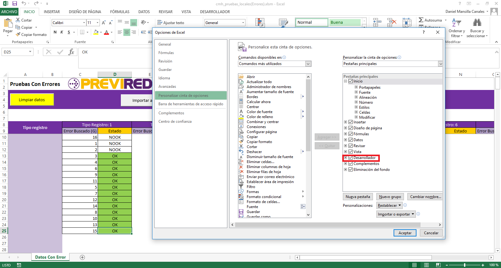
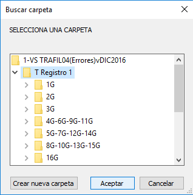
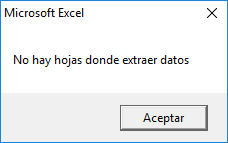
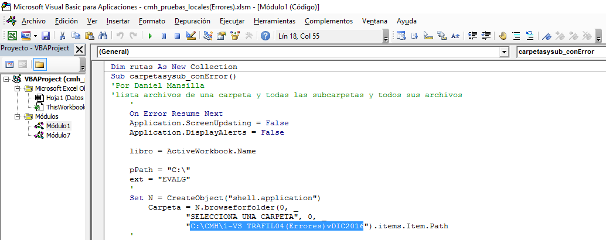
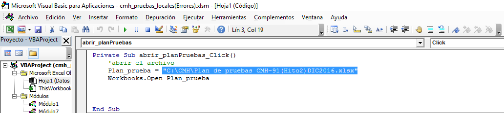
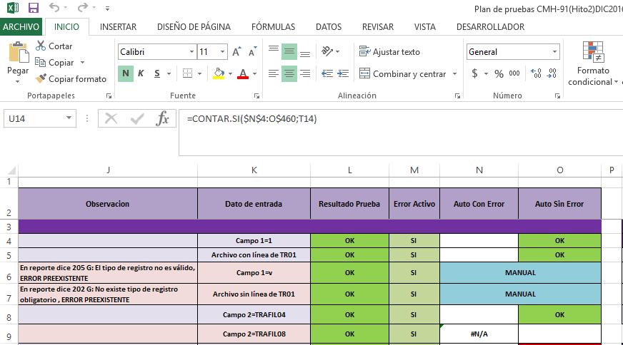

#Validador de pruebas locales del sistema CMH

Macros desarrolladas en Excel con el fin de validar si las pruebas realizadas localmente han sido correctas. Dependiendo del Excel que se abra **cmh_pruebas_locales(Errores)** o **cmh_pruebas_locales(SinErrores)** se realizarán las pruebas correspondientes.

___Nota: Para el desarrollo de las pruebas se han eliminado algunas carpetas que contenían archivos, todo esto con el fin de hacer pruebas del sistema de manera más eficiente y a la vez que el archivo no pese demasiado___

***

## Requisitos previos
* Tener instalado Excel versiones 2013 o posteriores (recomendado)
* Habilitar las opciones de desarrollador.

## Configuración inicial

Dirigirse a la ruta 

>C:\

Crear una carpeta con el nombre de **CMH** para no tener problema con las rutas especificadas en el Excel.

Extraer datos del archivo .rar dentro de la carpeta. (Para uso de pruebas, se han reducido la cantidad de pruebas locales, quedando en 3 subcarpetas dentro de cada **Tipo de Registro**)

Asegurarse de que dentro de las subcarpetas se encuentre un directorio con el nombre de **EVAL** y que este contenga un archivo con la extensión .EVALG.

## Ejecución

* **Paso 1**:  Abrir ambos archivos Excel (**cmh_pruebas_locales(Errores)** o **cmh_pruebas_locales(SinErrores)**).

* **Paso 2**:  Presionar el botón `Importar Archivo`.  Elegir el Tipo de Registro que se desea abrir y presionar `Aceptar`.

_No se recomienda importar más de un Tipo de Registro simultáneamente, ya que puede ocasionar errores el sistema_

* **Paso 3**: El sistema creará varias hojas en el libro de Excel, estas corresponden a cada archivo importado (No hay necesidad de revisar cada hoja creada). Luego, presionar el botón verde `Extraer datos`

* **Paso 4**: Presionar el botón rojo `Limpiar Hojas`, y repetir los pasos anteriores si se desean agregar más archivos.

* **Paso 5**: Finalmente, presionar el botón `Plan de pruebas` para abrir el archivo de plan de pruebas que deberá estar alojado dentro de la carpeta raíz de de los archivos.
_Ejemplo:_ 
> C:\CMH\

### Excepciones
 
 * En caso de equivocarse, o querer comenzar todas las pruebas nuevamente, al presionar el botón amarillo `Limpiar datos`, se estarán eliminando los registros que se tenían con anterioridad, permitiendo así volver a comenzar con las pruebas.
 * El sistema solo contempla la extracción de archivos de **Tipo de Registro 1** hasta el **Tipo de Registro 9**, en caso de importar archivos anexos a estos, el botón de `Extraer datos`no los reconocerá.

 

 * En caso de no querer utilizar la ruta recomendada (`C:\`), entrar a modificar el código para cambiar las rutas.

 

 

***

## Importante!

Existen algunas pruebas que no son posible de verificar mediante el sistema Excel, ya que estas requieren que sean un trabajo de forma manual. 
_Las pruebas que deben realizarse de forma manual, se encuentran adjuntas en un archivo .txt `pruebas_manuales.txt`_

___De todos modos, en el Excel `Plan de Pruebas` se marcarán estas mismas pruebas con la leyenda "Manual".___

 

_Como se puede ver en la imagen anterior, las pruebas que corresponden a pruebas "Manuales" están destacadas con color Celeste._

